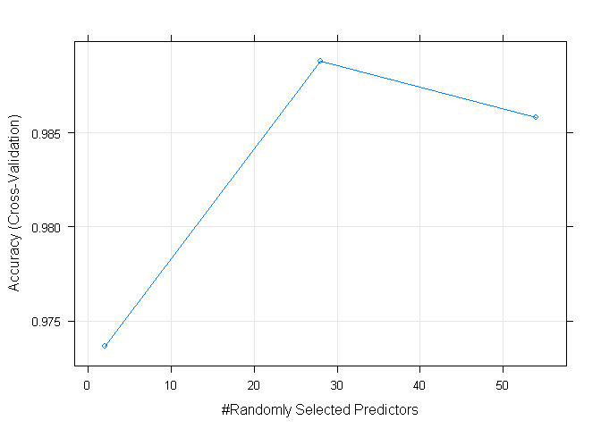
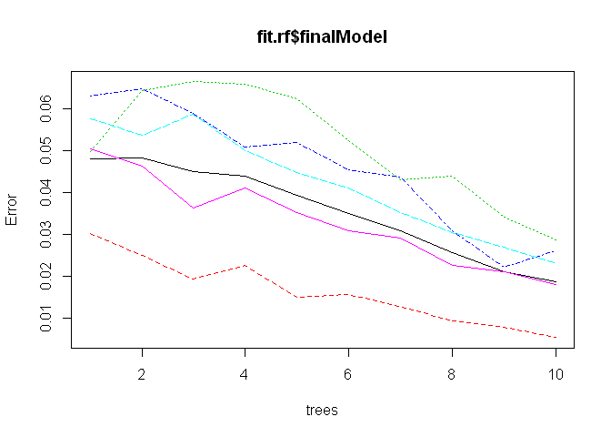
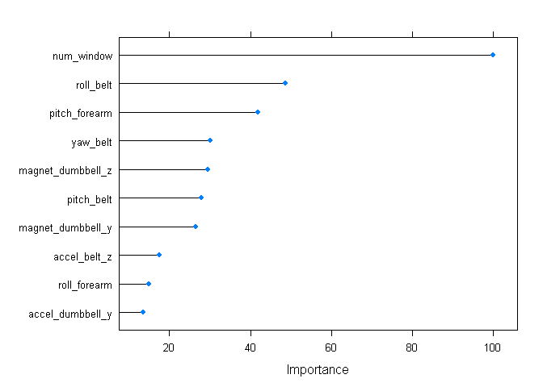

Machine Learning Assignment
================
15 July 2016

1-Introduction
==============

The goal of this project is to predict the manner in which people exercise.Data from accelerometers on the belt, forearm, arm, and dumbell of 6 participants have been used to developed the predictive model. More information regading the data is available from the following [website](http://groupware.les.inf.puc-rio.br/har).

### Running relevant libraries

``` r
library("data.table")
library("caret")
library("mlbench")
library("dplyr")
library("parallel")
library("doParallel")
library("rattle")
```

2- Loading and cleaning data
============================

``` r
# TRAINING DATA
## getting training data
data.train<-read.csv(url("https://d396qusza40orc.cloudfront.net/predmachlearn/pml-training.csv"),na.strings = c("", "NA","#DIV/0!" ))
## Filtering variables with more than 80% NAs values
df.train<-data.train[ , colSums(is.na(data.train)) 
                      < nrow(data.train)*0.8]
# remove identification only variables (columns 1 to 5)
df.train <- df.train[, -(1:5)]
dim(df.train)
```

    ## [1] 19622    55

``` r
# TESTING DATA
## getting testing data
data.test<-read.csv(url("https://d396qusza40orc.cloudfront.net/predmachlearn/pml-testing.csv"))
df.test<-data.test[ , colSums(is.na(data.test)) 
                      < nrow(data.test)*0.8]
# remove identification only variables (columns 1 to 5)
testing.x <- df.test[, -(1:5)]
dim(testing.x)
```

    ## [1] 20 55

``` r
#factor variables with different levels
levels(testing.x$cvtd_timestamp) <- levels(df.train$cvtd_timestamp)
levels(testing.x$new_window) <- levels(df.train$new_window)
```

3-How the model is built?
=========================

The model has been built by taking a training set, and splitting it into new training/test sets. Then, the model was developed based on the new training data, and evaluated based on the new test data set. At the end, new values are predicted based on the "orininal" testing data set.

### 3.1- Partition of the training data set

``` r
inTrain  <- createDataPartition(df.train$classe, p=0.6, list=FALSE)
train.set <- df.train[inTrain, ]
test.set  <- df.train[-inTrain, ]
dim(train.set)

##define outcome/predictors
x.train<-train.set[,-55]
y.train<-train.set[,55]
```

### 3.2- Cross validation and parallel processing

In addition to the training data set partition previously presented, an additional cross validation tool is performed in the model estimation. Specifically, we have established a training control method in which the data set is split into 3 folds. This is crutial to avoid overfitting when estimating the final model. Since this is a process consuming high computational resources we have also establish a parallel processing, as indicated in the coding bellow:

``` r
## Configuring parallell processing
cluster <- makeCluster(detectCores() - 1)
registerDoParallel(cluster)

##Configure trainControl object
fit.control <- trainControl(method = "cv",
                           number = 3,
                           allowParallel = TRUE)
```

4- Develop training model
=========================

We have choosen a Random Forest model which is highly accurate.

``` r
set.seed(673)
fit.rf<-train(x=x.train,y=y.train, method="rf", do.trace= TRUE, ntree=10, prox=TRUE,  trControl = fit.control)
```

    ## ntree      OOB      1      2      3      4      5
    ##     1:   4.81%  3.02%  4.98%  6.31%  5.77%  5.05%
    ##     2:   4.84%  2.50%  6.43%  6.48%  5.38%  4.64%
    ##     3:   4.52%  1.95%  6.65%  5.90%  5.88%  3.63%
    ##     4:   4.40%  2.27%  6.60%  5.10%  5.01%  4.13%
    ##     5:   3.94%  1.51%  6.24%  5.21%  4.49%  3.53%
    ##     6:   3.51%  1.58%  5.24%  4.56%  4.11%  3.10%
    ##     7:   3.09%  1.29%  4.31%  4.38%  3.54%  2.93%
    ##     8:   2.58%  0.95%  4.40%  3.11%  3.05%  2.27%
    ##     9:   2.11%  0.79%  3.43%  2.23%  2.70%  2.11%
    ##    10:   1.88%  0.55%  2.88%  2.61%  2.31%  1.82%

``` r
fit.rf
```

    ## Random Forest 
    ## 
    ## 11776 samples
    ##    54 predictor
    ##     5 classes: 'A', 'B', 'C', 'D', 'E' 
    ## 
    ## No pre-processing
    ## Resampling: Cross-Validated (3 fold) 
    ## Summary of sample sizes: 7852, 7850, 7850 
    ## Resampling results across tuning parameters:
    ## 
    ##   mtry  Accuracy   Kappa    
    ##    2    0.9736756  0.9666916
    ##   28    0.9887911  0.9858204
    ##   54    0.9858191  0.9820631
    ## 
    ## Accuracy was used to select the optimal model using  the largest value.
    ## The final value used for the model was mtry = 28.

5- Out of sample error
======================

In order to estimate the out sample error we first calculated the accuracy of the model. That can be done by using the testing model to predict the outcome based on the testing sub set obtained from the training data set. Then, such predictions are compared with the actual outcome in the testing data sub set. Finally, the out of sample error is equal to 1 - accuracy, in this case, 0.5%. Bellow the coding with the datails.

``` r
#Accuracy
pred_train <- predict( fit.rf, test.set)
confusionMatrix(pred_train, reference = test.set$classe)
```

    ## Confusion Matrix and Statistics
    ## 
    ##           Reference
    ## Prediction    A    B    C    D    E
    ##          A 2229    4    0    0    0
    ##          B    1 1504   20    0    3
    ##          C    0    8 1347    8    2
    ##          D    1    1    1 1277    6
    ##          E    1    1    0    1 1431
    ## 
    ## Overall Statistics
    ##                                           
    ##                Accuracy : 0.9926          
    ##                  95% CI : (0.9905, 0.9944)
    ##     No Information Rate : 0.2845          
    ##     P-Value [Acc > NIR] : < 2.2e-16       
    ##                                           
    ##                   Kappa : 0.9906          
    ##  Mcnemar's Test P-Value : NA              
    ## 
    ## Statistics by Class:
    ## 
    ##                      Class: A Class: B Class: C Class: D Class: E
    ## Sensitivity            0.9987   0.9908   0.9846   0.9930   0.9924
    ## Specificity            0.9993   0.9962   0.9972   0.9986   0.9995
    ## Pos Pred Value         0.9982   0.9843   0.9868   0.9930   0.9979
    ## Neg Pred Value         0.9995   0.9978   0.9968   0.9986   0.9983
    ## Prevalence             0.2845   0.1935   0.1744   0.1639   0.1838
    ## Detection Rate         0.2841   0.1917   0.1717   0.1628   0.1824
    ## Detection Prevalence   0.2846   0.1947   0.1740   0.1639   0.1828
    ## Balanced Accuracy      0.9990   0.9935   0.9909   0.9958   0.9960

``` r
#OOS Error
missClass = function(values, predicted) {
  sum(predicted != values) / length(values)
}
OOS_er = missClass(test.set$classe, pred_train)
OOS_er*100
```

    ## [1] 0.7392302

6- Model predictions
====================

When using the Testing data set, the estimated model resulted to be highly accurate to predict the outcomes provided in the course quiz.

``` r
### predictions
predict(fit.rf, testing.x)
```

    ##  [1] B A B A A E D B A A B C B A E E A B B B
    ## Levels: A B C D E

7- Why I made the choices I did?
================================

One of the main decisions I made was to select the type of predictive model to be fitted. I choose randome forest, first because it is one of the most accurate, and the overfitting associated risks can be addressed by implementing cross validatiopn. Second,n the original paper used a random forest model with 10 trees, and we decided to replicate such conditions.

In addition, we chose to use only 3 folds in the cross validation of the model training, because it provides enough accuracy and use less computational resources.

8- Additional Figures
=====================

``` r
##Model plot
plot(fit.rf)
```

<!-- -->

``` r
##Model Error
plot(fit.rf$finalModel)
```

<!-- -->

``` r
##Top 15 variables by importance
plot(varImp(fit.rf), top = 10)
```

<!-- -->
